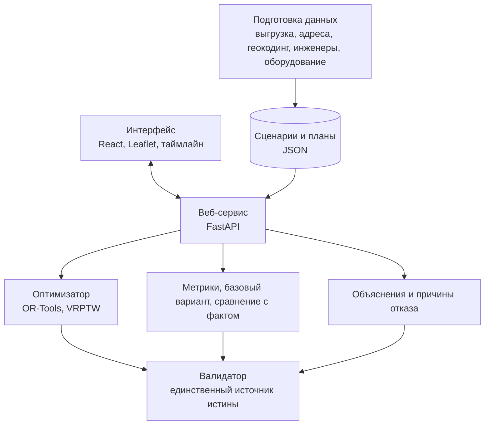

# Интеллектуальный сервис планирования рабочих маршрутов для инженеров

Решение задачи №3 от «билайн бизнес» на хакатоне «Лидеры цифровой трансформации 2026», команда «Ежи».

Помощник диспетчера выездной службы. Сервис распределяет заявки между инженерами с учётом квалификации, временных окон, транспорта и оборудования, строит каждому маршрут, показывает план на карте и таймлайне, объясняет каждое назначение понятным языком и перестраивает день, когда что-то меняется.

## Быстрый запуск

```bash
docker compose up --build
# открыть http://localhost:8000
```

Без Docker, через uv:

```bash
uv sync --extra dev
cd frontend && npm ci && npm run build && cd ..
uv run python -m planner.cli serve   # http://127.0.0.1:8000
```

Без uv, через обычный pip:

```bash
python -m venv .venv
.venv/Scripts/pip install -e ".[dev]"       # Linux и macOS: .venv/bin/pip
cd frontend && npm ci && npm run build && cd ..
.venv/Scripts/python -m planner.cli serve   # http://127.0.0.1:8000
```

Нужны Python 3.11 или новее и Node.js 18 или новее, uv по желанию. Группа `dev` добавляет pytest, без неё сервис работает, но тесты запустить не получится. Дальше команды приведены для uv, без него вместо `uv run python` пишите `.venv/Scripts/python`.

Интерфейс собирается в статику, и её отдаёт тот же сервис, поэтому после правок во фронтенде нужно заново выполнить `npm run build` и перезапустить сервис.

Данные готовы к запуску: сценарии с координатами и справочником инженеров лежат в `data/scenarios`, сеть и ключи сервису не нужны.

Расчёт в консоли, без интерфейса:

```bash
uv run python -m planner.cli plan --region demo --time-limit 30 --verbose
```

Тесты: `uv run python -m pytest -q`.

## Функционал

Основной:

- загружает готовый набор заявок и инженеров либо принимает свой файл CSV или JSON прямо в интерфейсе
- распределяет заявки между инженерами и определяет порядок посещения адресов
- показывает ход расчёта и улучшения плана по мере их поступления
- проверяет четыре группы ограничений: квалификацию, время, транспорт и оборудование
- показывает маршруты и точки заявок на карте
- показывает план по каждому инженеру на таймлайне и таблицей «кто, куда, во сколько»
- перестраивает план после события в течение дня, это авария, обычная заявка, отмена, недоступность или задержка инженера, причём визиты, к которым инженер уже выехал, остаются неприкосновенными
- объясняет каждое назначение: какие ограничения проверены и во что обошлась бы эта заявка другому инженеру
- показывает неназначенные заявки с конкретной причиной по каждой
- считает обязательные метрики и сравнивает план с базовым вариантом и с фактическим ручным распределением

Дополнительный:

- ручное переназначение заявки с проверкой тех же ограничений и предварительным просмотром затронутых маршрутов для допустимых кандидатов
- выбор критерия оптимизации; в автоматическом режиме параллельно рассчитываются три варианта, включая сбалансированную загрузку, и диспетчер может выбрать рабочий план
- симуляция рабочего дня с воспроизведением подготовленных и добавленных событий и перепланированием по мере их наступления
- настраиваемое число бригад на участке
- перенос обещанного клиенту времени при перепланировании, по явному решению диспетчера
- оценка «нужно ещё столько-то инженеров», чтобы закрыть участок полностью
- метрика риска опоздания и время реакции на аварию
- выгрузка результата в формате, который требует задание

## Архитектура



Ключевое решение: времена, пробег и метрики никогда не берутся из оптимизатора напрямую, их всегда пересчитывает валидатор. Через него проходят и оптимизатор, и базовый вариант, и ручное переназначение. Поэтому показанное диспетчеру не может разойтись с тем, что посчитал алгоритм, а план с нарушением ограничений физически не попадает в интерфейс.

Подробности в документации:

- [docs/architecture.md](docs/architecture.md), из чего собран сервис и как данные проходят через него
- [docs/algorithm.md](docs/algorithm.md), логика оптимизации, ограничения, метрики и сравнение с базовым вариантом
- [docs/data.md](docs/data.md), поля, единицы измерения, справочники и как собраны данные
- [docs/assumptions.md](docs/assumptions.md), принятые допущения с указанием источника каждого
- [docs/api.md](docs/api.md), описание HTTP API
- [docs/design.md](docs/design.md), замысел решения, зафиксированный до написания кода
- [docs/case-rules.md](docs/case-rules.md), правила кейса, разъяснения организатора и источники требований
- [docs/verification.md](docs/verification.md), как воспроизвести результаты и провести показ

## Данные

Выгрузка содержит три участка на 17.08.2026: восток с 66 заявками, юго-восток с 83 и югоцентр с 56. По каждому есть синтетический и контрольный файлы. В расчётах используются только синтетические, потому что постановщик прямо указал, что контрольное распределение это ориентир, а не эталон.

Справочника инженеров в выгрузке нет, поэтому он создан самостоятельно, как разрешает задание. Число инженеров взято по числу бригад в контрольном файле, навыки распределены пропорционально спросу по рабочим минутам, транспорт и смены заданы квотами в конфигурации.

Пересобрать данные с нуля:

```bash
uv run python -m planner.cli build       # CSV выгрузки в сценарии
uv run python -m planner.cli geocode     # адреса в координаты, нужна сеть
uv run python -m planner.cli engineers   # справочник инженеров
uv run python -m planner.cli demo        # демонстрационный набор с событиями
```

## Стек

Алгоритм и бэкенд на Python 3.11, FastAPI и Google OR-Tools. Интерфейс на React, TypeScript и Vite. Карта на OpenStreetMap и Leaflet. Хранение в JSON-файлах. Запуск локально или через Docker.

Геокодирование сделано заранее и офлайн, координаты лежат в репозитории. Использована лестница бесплатных сервисов: DaData, затем Nominatim и Photon, в крайнем случае центроид района. Из 205 адресов 96 процентов определены точно до дома. В работе сервис к геокодерам не обращается.

## Известные ограничения

Горизонт планирования это один рабочий день и один участок за прогон, переносы на другие дни не моделируются. Навыки, смены и транспорт инженеров созданы синтетически: в исходной выгрузке их нет. Время в пути считает модель со средними скоростями, а не маршрутизатор: пробки, парковка и подъём к квартире усреднены, коэффициент перевода прямой в дорогу откалиброван по реальной сети с медианной ошибкой 8.8 процента. Маршрутизатор OSRM подключается по желанию переменной `OSRM_URL` и даёт настоящие расстояния по дорогам. Поиск ограничен временем и не доказывает математическую оптимальность результата. Составы бригад из нескольких человек и повторные визиты вынесены за рамки. Статусы выполнения в реальном времени не поступают, событие вводит диспетчер вручную, хотя механика перепланирования к приёму потока статусов готова.

## Перспективы развития

- Маршрутизатор с учётом общественного транспорта и исторических пробок по часам.
- Планирование на несколько дней вперёд и работа со слотами, которые открываются заранее.
- Подсказка диспетчеру по составу оборудования, которое инженеру взять с собой утром.
- Приём статусов «в пути», «в работе», «выполнено» и автоматическое перепланирование по факту отклонения от плана.
