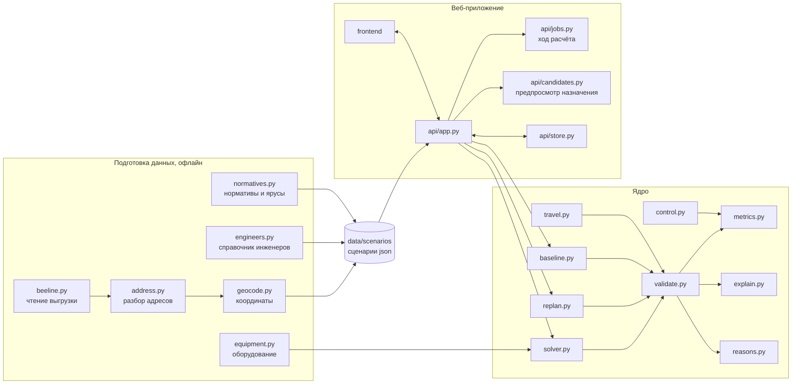

# Архитектура

Назад в [README.md](../README.md).

Документ отвечает на вопрос, из чего собран сервис и как данные проходят через него. Логика оптимизации описана отдельно в [algorithm.md](algorithm.md), состав данных в [data.md](data.md).

## Три слоя

Сервис разложен на подготовку данных, вычислительное ядро и веб-приложение поверх него.

## Подготовка данных

Этот слой работает один раз, до запуска сервиса, и превращает выгрузку в канонические сценарии.

`beeline.py` читает файлы выгрузки в кодировке cp1251 или UTF-8 с разделителем «;», «,» или табуляцией, разделяет три участка и приводит колонки к внутренней модели. `address.py` нормализует адреса, которые в выгрузке записаны разнородно. `geocode.py` проставляет координаты лестницей внешних сервисов и кладёт результат в кэш, который хранится в репозитории. `engineers.py` создаёт справочник исполнителей, которого в выгрузке нет. `normatives.py` подтягивает длительности работ и ярусы приоритета из конфигурации. `equipment.py` выводит потребность заявки в оборудовании и утренний запас бригады.

Результат это файл сценария в `data/scenarios`: заявки с координатами и окнами, инженеры со сменами и транспортом, офис участка, заготовленные события. Сервис в работе к внешним источникам не обращается совсем.

## Ядро

`solver.py` решает задачу маршрутизации и возвращает только распределение заявок и порядок их посещения. Времена он не выставляет.

`validate.py` считает по этому порядку всю арифметику маршрута: прибытие, ожидание, начало и конец работ, пробег, расход оборудования, и проверяет каждое ограничение. Это единственное место в сервисе, где рождаются времена и метрики. Через него проходят и результат оптимизатора, и базовый вариант, и ручное переназначение диспетчера. Смысл такой схемы в том, что показанное человеку не может разойтись с посчитанным, а план с нарушением ограничений не попадает в интерфейс физически, потому что его просто нечему туда положить.

`replan.py` перестраивает день после события по схеме «заморозить прошлое, пересчитать будущее»: визиты, к которым инженер уже выехал, считаются неприкосновенными, всё остальное возвращается в общий пул и решается заново со штрафом за смену исполнителя.

`baseline.py` строит базовый вариант для сравнения, `metrics.py` считает метрики и таблицу сравнения, `control.py` сопоставляет план с фактическим ручным распределением из контрольного файла.

`explain.py` собирает объяснения назначений, `reasons.py` формулирует причины, по которым заявка осталась без исполнителя. Оба работают шаблонами из фактов плана, без языковой модели, поэтому воспроизводимы и не выдумывают.

`travel.py` отвечает за время в пути и расстояния, `geometry.py` за геометрию линий для карты.

## Веб-приложение

`api/app.py` принимает запросы FastAPI и собирает ответы из результатов ядра. При автоматическом расчёте он считает `min_engineers` и `min_distance` одновременно, затем выравнивает загрузку во втором и получает `balanced`, выбирает основной план из первых двух, а все три сохраняет для выбора диспетчером. `api/jobs.py` ведёт фоновые расчёты и передаёт прогресс через Server-Sent Events. `api/candidates.py` проверяет возможные назначения заявки и возвращает предварительные маршруты до ручного изменения плана. `api/store.py` хранит планы в памяти процесса со сбросом на диск, чтобы объяснения, ручные назначения и события работали по идентификатору плана. Описание эндпоинтов в [api.md](api.md).

Интерфейс собран на React и TypeScript. `App.tsx` хранит выбранный сценарий, текущий план, варианты и историю событий. `usePlanningRequests.ts` запускает расчёт и перепланирование, получает прогресс; `api.ts` описывает HTTP-запросы и поток событий. `useSimulation.ts` ведёт время и события симуляции. `MapView.tsx` рисует маршруты и заявки на Leaflet, `Schedule.tsx` показывает день инженеров, `JobQueue.tsx` и `JobPanel.tsx` помогают разбирать заявки и ручные назначения, `Simulation.tsx` показывает изменения в течение дня.

Интерфейс собирается в статику и отдаётся тем же сервисом, поэтому в развёрнутом виде это одно приложение на одном порту.

## Почему такой стек

Задание рекомендовало Python, FastAPI и OR-Tools для алгоритма, React или streamlit для интерфейса, OpenStreetMap с Leaflet для карты. Взято почти всё рекомендованное.

Единственное осознанное отклонение это отказ от streamlit в пользу React. Задание требует наглядно показать, что именно изменилось после события, а это сравнение «до и после» на карте и таймлайне, которое неудобно делать перерисовкой страницы целиком.

Хранение оставлено на JSON-файлах, потому что задание относит субд к необязательному, а объём данных это один рабочий день одного участка.
